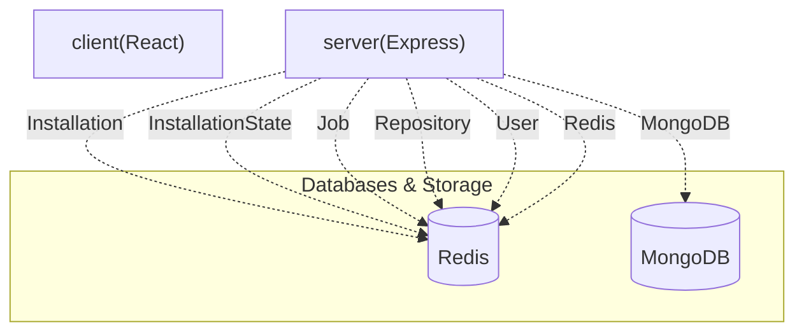

# 🚀 pushdoc-client

[](https://github.com/SudeepKagi/PushDoc)

> **A React-powered frontend for repository documentation automation.** — This repository provides the user interface for managing GitHub App installations, syncing repositories, triggering documentation generation jobs, and viewing their status, interacting with a dedicated backend service.

        

---

## 📋 Table of Contents
- [✨ Features](#-features)
- [🛠️ Tech Stack](#️-tech-stack)
- [🏛️ System Architecture](#️-system-architecture)
- [📁 Project Structure](#-project-structure)
- [⚙️ Installation & Setup](#️-installation--setup)
- [🔐 Environment Variables](#-environment-variables)
- [🌐 API Reference](#-api-reference)
- [🗄️ Database Models](#-database-models)
- [📜 Available Scripts](#-available-scripts)

---

## ✨ Features

👋 **Authentication & User Management**
Users can register, login, and logout, with authentication managed through GitHub OAuth. The system stores user profiles and GitHub access tokens for seamless integration.

⚙️ **GitHub App Installation & Repository Sync**
Manages the lifecycle of GitHub App installations and provides capabilities to sync user repositories. This ensures that the application has the necessary permissions and up-to-date information for chosen repositories.

⚡ **Background Job Processing**
Asynchronous workflows and queue processing are managed using BullMQ. This capability offloads heavy operations, such as documentation generation, to background workers, preventing blockages in the main application thread.

📦 **Installation State Management**
Provides database storage and operations for managing transient installation states. This ensures that multi-step installation flows, such as GitHub App setup, maintain context securely.

📜 **Job & Repository Monitoring**
Users can view a list of initiated jobs, including their status, and retrieve detailed logs for specific jobs. Repository management features allow for toggling activity and triggering documentation generation manually.

📄 **Repository Readme Retrieval & Generation**
The system can fetch the current `README` content for a given repository. It also supports triggering processes to potentially generate new `README` content based on repository data.

🔑 **Secure API Integration with AI Models**
Configured with API keys for Google Gemini and Groq, enabling potential integration with advanced AI models for tasks such as content generation or analysis within repository processing workflows.

---

## 🛠️ Tech Stack

| Category | Technology | Purpose & Role in Codebase |
| :--------------------------- | :-------------------- | :------------------------------------------------------------------------- |
| **Frontend/UI** | React | User interface construction and component-based development. |
| | Vite | Fast frontend development build tool and development server. |
| | Tailwind CSS | Utility-first CSS framework for efficient styling. |
| | Radix UI | Primitives for building accessible, high-quality UI components. |
| | `lucide-react` | Icon library for common UI elements. |
| | `sonner` | Library for displaying toast notifications to users. |
| **Backend Runtime** | Node.js | JavaScript runtime environment for server-side logic and API operations. |
| **Persistence & Caching** | MongoDB | Primary NoSQL datastore for persistent storage of application entities. |
| | Redis | Used for caching data, managing session states, and backing the job queue. |
| **Task Queue & Background Jobs** | | Manages asynchronous workflows and queue processing using a Redis-backed queue system. |
| **AI & Inference** | Google Gemini | Provides AI capabilities via API keys for content generation. |
| | Groq | Provides AI capabilities via API keys for content generation. |
| **Authentication & Security** | JWT | Secure token-based authentication for protecting API endpoints. |
| | GitHub App | Manages integration, authorization, and event handling with GitHub. |
| **Tooling** | Autoprefixer | Automatically adds vendor prefixes to CSS rules. |
| | PostCSS | A tool for transforming CSS with JavaScript plugins. |
| | `class-variance-authority` | Utility for managing component variants. |
| | `clsx` | Utility for conditionally joining classNames. |
| | `tailwind-merge` | Utility for merging Tailwind CSS classes without conflicts. |

---

## 🏛️ System Architecture

The application operates as a client-server architecture, with the `pushdoc-client` serving as the React-based frontend. This client communicates with a `server` service, which handles API requests, interacts with `MongoDB` for persistent data storage, and utilizes `Redis` for caching and managing asynchronous background jobs via BullMQ. The system processes GitHub App events and manages repository-related workflows.





---

## 📁 Project Structure

```
├── .github/ # GitHub Actions workflows and configuration
│ └── workflows
├── client/ # Frontend service: React application
│ ├── .env.example # Example environment variables for client
│ ├── index.html # Main HTML entry point
│ ├── package-lock.json # Lock file for client dependencies
│ ├── package.json # Package manifest for client-side dependencies and scripts
│ ├── src # Client-side source code (React components, styles, etc.)
│ ├── tailwind.config.js # Tailwind CSS configuration
│ └── vite.config.js # Vite build configuration
├── server/ # Backend service: Node.js API
│ ├── .env.example # Example environment variables for server
│ ├── nodemon.json # Nodemon configuration for development auto-restarts
│ ├── package-lock.json # Lock file for server dependencies
│ ├── package.json # Package manifest for server-side dependencies and scripts
│ ├── server.js # Main entry point for the backend server
│ └── src # Server-side source code (controllers, models, routes, services)
├── README.md # Project README file
├── package-lock.json # Root package lock file (if any shared dependencies)
├── package.json # Root package manifest (potentially for monorepo scripts/metadata)
└── render.yaml # Render.com deployment configuration
```

---

## ⚙️ Installation & Setup

To get the `pushdoc-client` and its associated backend running locally, follow these steps:

### 1. Prerequisites

Ensure you have the following installed:
* Node.js (LTS version recommended)
* npm (comes with Node.js)
* MongoDB (running instance accessible via `MONGODB_URI`)
* Redis (running instance accessible via `REDIS_URL` or `REDIS_HOST`/`REDIS_PORT`)
* Git

### 2. Clone & Install Dependencies

First, clone the repository and navigate into the project directory. Then install dependencies for both the client and server components.

```bash
git clone <repository-url>
cd pushdoc-client # or your repository name

# Install root dependencies (if any, typically for monorepos)
npm install

# Install client dependencies
cd client
npm install
cd ..

# Install server dependencies
cd server
npm install
cd ..
```

### 3. Environment Setup

Copy the example environment variable files and fill in the necessary values.

```bash
cp client/.env.example client/.env
cp server/.env.example server/.env
```

Edit `client/.env` and `server/.env` with your specific configurations. Crucial variables include `MONGODB_URI`, `REDIS_URL`, `GITHUB_CLIENT_ID`, `GITHUB_CLIENT_SECRET`, `GITHUB_APP_ID`, `GITHUB_WEBHOOK_SECRET`, `JWT_SECRET`, `GEMINI_API_KEY_1`, and `GROQ_API_KEY_1`.

### 4. Running Locally

Start the backend server and the frontend client in separate terminal windows.

```bash
# In the project root, start the server
node server/server.js
```

```bash
# In the project root, start the client development server
npm run dev
```

The client application will typically be accessible at `http://localhost:5173` (default Vite port) and the server at `http://localhost:PORT` (where `PORT` is defined in `server/.env`).

### 5. Production Build

To create a production-ready build of the client application:

```bash
npm run build
```

This command will compile the client-side assets into the `dist` directory.

---

## 🔐 Environment Variables

The following environment variables are used to configure the application.

| Variable | Description | Example / Default | Required |
| :------------------------ | :----------------------------------------------------- | :------------------------------------------ | :------- |
| `NODE_ENV` | Node.js environment mode. | `development` / `production` | Yes |
| `PORT` | Port on which the server will listen. | `3000` | Yes |
| `CORS_ORIGIN` | Allowed origin for Cross-Origin Resource Sharing. | `http://localhost:5173` | Yes |
| `MONGODB_URI` | Connection string for MongoDB database. | `mongodb://localhost:27017/pushdoc` | Yes |
| `REDIS_URL` | Connection URL for Redis server (overrides host/port). | `redis://localhost:6379` | No |
| `REDIS_HOST` | Hostname for the Redis server. | `localhost` | Yes |
| `REDIS_PORT` | Port for the Redis server. | `6379` | Yes |
| `GITHUB_CLIENT_ID` | GitHub OAuth App Client ID. | `your_github_oauth_client_id` | Yes |
| `GITHUB_CLIENT_SECRET` | GitHub OAuth App Client Secret. | `your_github_oauth_client_secret` | Yes |
| `GITHUB_REDIRECT_URI` | Redirect URI for GitHub OAuth callback. | `http://localhost:3000/github/callback` | Yes |
| `GITHUB_APP_ID` | GitHub App ID for API access. | `your_github_app_id` | Yes |
| `GITHUB_APP_NAME` | Name of the GitHub App. | `pushdoc` | Yes |
| `GITHUB_WEBHOOK_SECRET` | Secret for verifying GitHub webhooks. | `your_github_webhook_secret` | Yes |
| `GITHUB_PRIVATE_KEY_PATH` | Path to the GitHub App's private key file. | `/path/to/your/github-app-private-key.pem` | Yes |
| `JWT_SECRET` | Secret key for signing JSON Web Tokens. | `a_strong_jwt_secret_key` | Yes |
| `GEMINI_API_KEY_1` | API Key 1 for Google Gemini AI service. | `your_gemini_api_key_1` | Yes |
| `GEMINI_API_KEY_2` | API Key 2 for Google Gemini AI service. | `your_gemini_api_key_2` | No |
| `GEMINI_API_KEY_3` | API Key 3 for Google Gemini AI service. | `your_gemini_api_key_3` | No |
| `GROQ_API_KEY_1` | API Key 1 for Groq AI service. | `your_groq_api_key_1` | Yes |
| `GROQ_API_KEY_2` | API Key 2 for Groq AI service. | `your_groq_api_key_2` | No |
| `WORKSPACE_ROOT_PATH` | Root path for temporary workspace files. | `./workspace` | Yes |

---

## 🌐 API Reference

The backend service exposes the following API endpoints:

| Method | Endpoint | Description | Auth Required |
| :----- | :---------------------------------- | :---------------------------------------------------------- | :------------ |
| `GET` | `/github/login` | Initiates GitHub OAuth login flow. | No |
| `GET` | `/github/callback` | Handles GitHub OAuth callback and user authentication. | No |
| `GET` | `/me` | Retrieves the currently authenticated user's profile. | Yes |
| `POST` | `/logout` | Logs out the current user. | Yes |
| `GET` | `/app` | Retrieves GitHub App details. | No |
| `GET` | `/install` | Initiates GitHub App installation flow. | No |
| `GET` | `/install/callback` | Handles GitHub App installation callback. | No |
| `GET` | `/repositories/sync` | Triggers synchronization of user repositories. | Yes |
| `GET` | `/jobs` | Retrieves a list of all processing jobs. | Yes |
| `GET` | `/jobs/:jobId/logs` | Fetches logs for a specific job. | Yes |
| `POST` | `/jobs/:jobId/cancel` | Cancels a running job. | Yes |
| `GET` | `/repositories/:repoId/readme` | Retrieves the README content for a specific repository. | Yes |
| `POST` | `/repositories/:repoId/trigger` | Triggers a documentation generation job for a repository. | Yes |
| `GET` | `/events/stream` | Establishes an SSE connection for real-time events. | Yes |
| `PATCH`| `/repositories/:repoId/toggle` | Toggles the active status of a repository. | Yes |
| `GET` | `/health` | Checks the health status of the application. | No |
| `GET` | `/ready` | Checks the readiness status of the application. | No |
| `GET` | `/` | Root endpoint providing basic server status. | No |
| `POST` | `/github` | Endpoint for receiving GitHub webhook events. | No |

---

## 🗄️ Database Models

The application utilizes MongoDB to persist the following data models:

| Model | Key Fields | Purpose & System Relationships |
| :-------------- | :-------------------------------------------- | :----------------------------------------------------------------------------------------------------- |
| `Installation` | `installationId`, `user`, `accountLogin`, `accountType` | Stores details of a GitHub App installation, linking to a `User`. |
| `InstallationState` | `state`, `user`, `expiresAt` | Manages temporary state during the GitHub App installation process, linked to a `User`. |
| `Job` | `repository`, `bullJobId`, `commitSha`, `branch`, `status` | Records the details and status of each documentation generation job, referencing a `Repository`. |
| `Repository` | `githubId`, `installation`, `name`, `fullName`, `owner`, `private`, `cloneUrl`, `isActive` | Stores information about a synchronized GitHub repository, linked to an `Installation`. |
| `User` | `githubId`, `username`, `displayName`, `email`, `avatarUrl`, `githubAccessToken`, `provider` | Stores user profiles authenticated via GitHub, including their access token. |

---

## 📜 Available Scripts

The client-side `package.json` defines the following scripts for managing the client application:

* `dev`: Starts the Vite development server for the client application.
* `start`: Alias for `dev`, also starts the Vite development server.
* `build`: Compiles the client application for production using Vite.