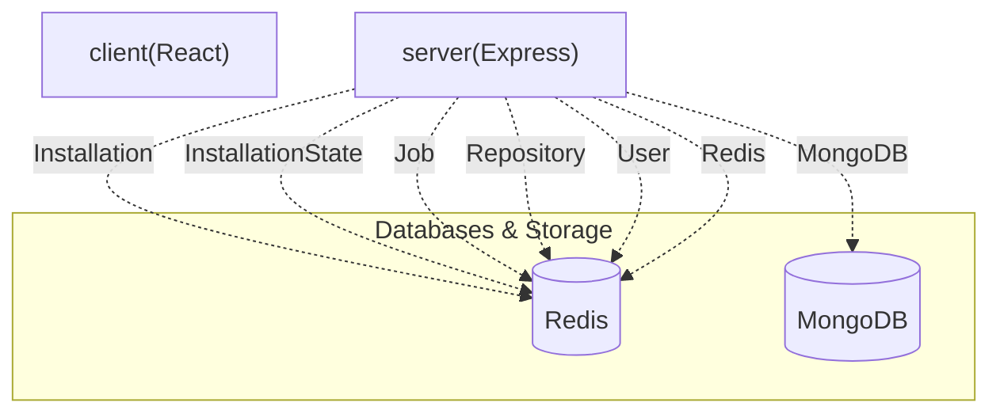

# 🤖 PushDoc

[](https://github.com/SudeepKagi/PushDoc)

> PushDoc is a full-stack application and GitHub App that automates the generation of professional README.md files for your repositories using advanced AI models, with a comprehensive dashboard to manage the process.

       

---

## 📋 Table of Contents

* [✨ Features](#-features)
* [🛠️ Tech Stack](#️-tech-stack)
* [📁 Project Structure](#-project-structure)
* [⚙️ Installation & Setup](#️-installation--setup)
* [🔐 Environment Variables](#-environment-variables)
* [🌐 API Reference](#-api-reference)
* [🗄️ Database Models](#-database-models)
* [📜 Available Scripts](#-available-scripts)

---

## ✨ Features

* **AI-Powered README Generation**: Automatically generates professional `README.md` files for your GitHub repositories using Google Gemini and Groq AI models.
* **Seamless GitHub Integration**: Functions as a GitHub App, allowing direct integration with your repositories and responding to webhook events.
* **Intuitive Dashboard**: A React-based frontend provides a user-friendly interface to manage repositories and monitor README generation jobs.
* **GitHub Authentication**: Secure user authentication and authorization via GitHub OAuth.
* **Automated Workflow Management**: Manages asynchronous README generation jobs, from cloning repositories to committing and pushing the generated `README.md`.
* **Real-time Job Tracking**: Monitor the status of README generation jobs, view logs, and cancel ongoing processes directly from the dashboard.
* **Repository Synchronization**: Sync your GitHub repositories with the application to easily select which ones to manage.
* **Toggle Repository Activity**: Activate or deactivate README generation for specific repositories.
* **Persistent Data Storage**: Stores user, installation, repository, and job data using MongoDB and Redis.

---

## 🛠️ Tech Stack

| Category | Technology | Purpose & Role |
| :------------------ | :------------------- | :------------------------------------------------------------ |
| **Frontend** | React | JavaScript library for building interactive user interfaces. |
| **Backend** | Node.js | JavaScript runtime for server-side logic and API. |
| **API Framework** | Express | Fast, unopinionated, minimalist web framework for Node.js. |
| **Database** | MongoDB | NoSQL database for persistent storage of application data. |
| **Cache & Queue** | Redis | In-memory data store for caching, session management, and background job queuing. |
| **AI/LLM** | Google Gemini | Powers advanced AI model inference for content generation. |
| **AI/LLM** | Groq | Powers advanced AI model inference for content generation. |
| **UI Components** | Radix UI | A set of unstyled, accessible UI components for React. |
| **Styling** | Tailwind CSS | Utility-first CSS framework for rapid UI development. |
| **Utilities** | clsx, lucide-react, sonner, tailwind-merge | Various utilities for class management, icons, toasts, and Tailwind class merging. |
| **Authentication** | JWT | JSON Web Tokens for secure, stateless user sessions. |
| **Build Tools** | Vite | Next generation frontend tooling for a fast development experience. |

---

## 📁 Project Structure

```
.
├── .github/ # GitHub Actions workflows for CI/CD
│ └── workflows
├── client/ # Frontend application powered by React and Vite
│ ├── .env.example # Example environment variables for the client
│ ├── index.html # Main HTML file for the client application
│ ├── package-lock.json
│ ├── package.json # Frontend dependencies and scripts
│ ├── src # Client-side source code
│ ├── tailwind.config.js # Tailwind CSS configuration
│ └── vite.config.js # Vite build configuration
├── server/ # Backend application powered by Node.js and Express
│ ├── .env.example # Example environment variables for the server
│ ├── nodemon.json # Nodemon configuration for development
│ ├── package-lock.json
│ ├── package.json # Backend dependencies and scripts
│ ├── server.js # Main server entry point
│ └── src # Server-side source code (controllers, models, routes)
├── README.md # This README file
├── package-lock.json
├── package.json # Root level dependencies (often used for monorepo tooling)
└── render.yaml # Configuration for Render deployment
```

---

## ⚙️ Installation & Setup

Follow these steps to set up and run PushDoc locally.

1. **Clone the repository:**

 ```bash
 git clone https://github.com/your-username/pushdoc.git
 cd pushdoc
 ```

2. **Install dependencies for the client:**

 ```bash
 cd client
 npm install
 cd ..
 ```

3. **Install dependencies for the server:**

 ```bash
 cd server
 npm install
 cd ..
 ```

4. **Configure Environment Variables:**
 Create a `.env` file in the `server/` directory and populate it based on `server/.env.example`.

 ```bash
 cp server/.env.example server/.env
 ```

 You will need to fill in values for:
 * MongoDB connection URI (`MONGODB_URI`)
 * Redis connection details (`REDIS_URL`, `REDIS_HOST`, `REDIS_PORT`)
 * GitHub App credentials (`GITHUB_CLIENT_ID`, `GITHUB_CLIENT_SECRET`, `GITHUB_APP_ID`, `GITHUB_APP_NAME`, `GITHUB_WEBHOOK_SECRET`, `GITHUB_PRIVATE_KEY_PATH`, `GITHUB_REDIRECT_URI`)
 * JWT secret (`JWT_SECRET`)
 * AI API Keys (`GEMINI_API_KEY_1`, `GEMINI_API_KEY_2`, `GEMINI_API_KEY_3`, `GROQ_API_KEY_1`, `GROQ_API_KEY_2`)

5. **Start the Development Servers:**

 To run the client (frontend):
 ```bash
 cd client
 npm run dev
 ```

 To run the server (backend):
 (Please refer to the project's specific server start command, typically `npm start` or `node server.js` in the `server/` directory, which is not listed in confirmed scripts but is essential for the backend.)

---

## 🔐 Environment Variables

The application relies on the following environment variables, typically configured in a `.env` file in the `server/` directory.

| Variable | Required | Description |
| :------------------------ | :------- | :------------------------------------------------------------- |
| `NODE_ENV` | Yes | Node.js environment (e.g., `development`, `production`). |
| `PORT` | Yes | The port on which the server will listen. |
| `CORS_ORIGIN` | Yes | URL allowed to make cross-origin requests to the API. |
| `MONGODB_URI` | Yes | Connection string for MongoDB database. |
| `REDIS_URL` | Yes | Connection URL for Redis (e.g., `redis://localhost:6379`). |
| `REDIS_HOST` | Yes | Hostname for Redis server. |
| `REDIS_PORT` | Yes | Port for Redis server. |
| `GITHUB_CLIENT_ID` | Yes | GitHub OAuth App Client ID. |
| `GITHUB_CLIENT_SECRET` | Yes | GitHub OAuth App Client Secret. |
| `GITHUB_REDIRECT_URI` | Yes | Redirect URI for GitHub OAuth callbacks. |
| `GITHUB_APP_ID` | Yes | Unique ID for your GitHub App. |
| `GITHUB_APP_NAME` | Yes | Name of your GitHub App. |
| `GITHUB_WEBHOOK_SECRET` | Yes | Secret for verifying GitHub webhook payloads. |
| `GITHUB_PRIVATE_KEY_PATH` | Yes | Path to the GitHub App's private key file. |
| `JWT_SECRET` | Yes | Secret key for signing and verifying JSON Web Tokens. |
| `GEMINI_API_KEY_1` | Yes | API key for Google Gemini AI service. |
| `GEMINI_API_KEY_2` | Yes | Secondary API key for Google Gemini AI service. |
| `GEMINI_API_KEY_3` | Yes | Tertiary API key for Google Gemini AI service. |
| `GROQ_API_KEY_1` | Yes | API key for Groq AI service. |
| `GROQ_API_KEY_2` | Yes | Secondary API key for Groq AI service. |
| `WORKSPACE_ROOT_PATH` | Yes | Root path for temporary workspace files. |

---

## 🌐 API Reference

The PushDoc backend provides a comprehensive set of API endpoints to manage GitHub integrations, user authentication, and README generation jobs.

| Method | Endpoint | Auth | Description |
| :----- | :----------------------------- | :--- | :------------------------------------------------------------------------ |
| `GET` | `/github/login` | No | Initiates the GitHub OAuth login process. |
| `GET` | `/github/callback` | No | Callback URL for GitHub OAuth after successful authentication. |
| `GET` | `/me` | Yes | Retrieves the authenticated user's profile information. |
| `POST` | `/logout` | Yes | Logs out the current user, invalidating their session. |
| `GET` | `/app` | No | Retrieves information about the GitHub App. |
| `GET` | `/install` | No | Initiates the GitHub App installation process for a repository/organization. |
| `GET` | `/install/callback` | No | Callback URL after a successful GitHub App installation. |
| `GET` | `/repositories/sync` | Yes | Synchronizes the user's GitHub repositories with the application. |
| `GET` | `/jobs` | Yes | Retrieves a list of all README generation jobs. |
| `GET` | `/jobs/:jobId/logs` | Yes | Fetches logs for a specific README generation job. |
| `POST` | `/jobs/:jobId/cancel` | Yes | Cancels an ongoing README generation job. |
| `GET` | `/repositories/:repoId/readme` | Yes | Retrieves the current or generated README for a specific repository. |
| `POST` | `/repositories/:repoId/trigger`| Yes | Manually triggers README generation for a specific repository. |
| `GET` | `/events/stream` | Yes | Establishes a server-sent events (SSE) stream for real-time updates. |
| `PATCH`| `/repositories/:repoId/toggle` | Yes | Toggles the active status of a repository for automated README generation. |
| `GET` | `/health` | No | Health check endpoint to verify API server status. |
| `GET` | `/ready` | No | Readiness check endpoint for deployment orchestration. |
| `GET` | `/` | No | Root endpoint, returns basic API status and Redis connection health. |
| `POST` | `/github` | No | Webhook endpoint for receiving GitHub events (e.g., push, installation). |

---

## 🗄️ Database Models

PushDoc utilizes MongoDB to store various application entities.

| Model | Key Fields | Description |
| :-------------- | :------------------------------------------------------------------------------- | :--------------------------------------------------------------------- |
| `Installation` | `installationId`, `user`, `accountLogin`, `accountType` | Represents a GitHub App installation for a user/organization. |
| `InstallationState` | `state`, `user`, `expiresAt` | Manages temporary states during the GitHub App installation flow. |
| `Job` | `repository`, `bullJobId`, `commitSha`, `branch`, `status`, `generatedReadme` | Tracks the lifecycle and results of a README generation task. |
| `Repository` | `githubId`, `installation`, `name`, `fullName`, `owner`, `private`, `isActive` | Stores information about a GitHub repository integrated with PushDoc. |
| `User` | `githubId`, `username`, `email`, `githubAccessToken` | Stores user profile information and GitHub authentication tokens. |

---

## 📜 Available Scripts

The `client/package.json` includes several convenient scripts for development and building the frontend:

* **`npm run dev`**:
 Starts the Vite development server for the client. This command provides hot module reloading and a fast development experience.
* **`npm start`**:
 Starts the Vite development server for the client. (Often an alias for `npm run dev` in development setups).
* **`npm run build`**:
 Builds the client application for production, generating optimized static assets in the `dist` directory.

---

## 🏛️ System Architecture


