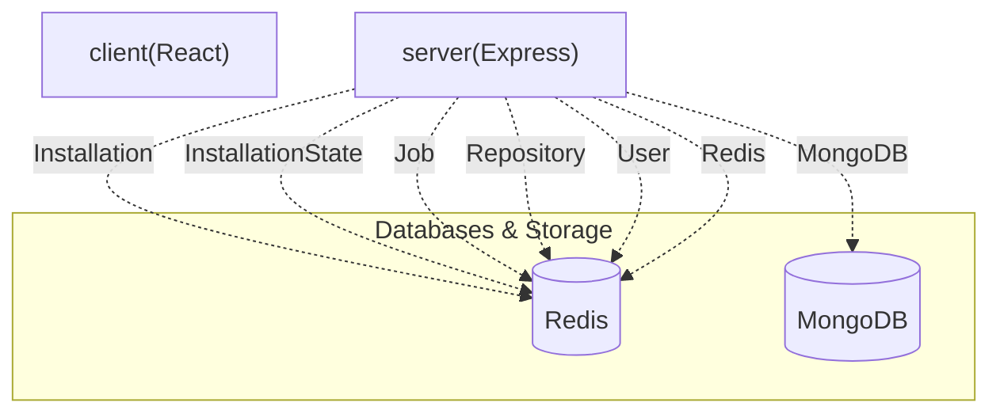

# ✨ PushDoc

[](https://github.com/SudeepKagi/PushDoc)

> PushDoc is a GitHub App that automatically generates and manages professional README.md files for your repositories using AI, providing a streamlined dashboard to monitor generation jobs and repository status.

       

---

## 📋 Table of Contents

* [✨ Features](#-features)
* [🛠️ Tech Stack](#️-tech-stack)
* [📁 Project Structure](#-project-structure)
* [⚙️ Installation & Setup](#️-installation--setup)
* [🔐 Environment Variables](#-environment-variables)
* [🌐 API Reference](#-api-reference)
* [🗄️ Database Models](#-database-models)
* [📜 Available Scripts](#-available-scripts)

---

## ✨ Features

* **AI-Powered README Generation**: Leverage advanced AI models (Google Gemini, Groq) to automatically generate high-quality, professional `README.md` files for your GitHub repositories.
* **Automated GitHub Webhook Integration**: Configure PushDoc as a GitHub App to listen for repository events and automatically trigger README generation or updates via webhooks.
* **Manual README Generation Trigger**: Manually initiate the README generation process for any tracked repository directly from the dashboard.
* **Real-time Job Monitoring & Logs**: Keep track of all README generation jobs, view their real-time status (queued, cloning, generating, committing, pushing, completed, failed), and access detailed logs for debugging.
* **Repository Management & Activation**: Sync your GitHub repositories, activate or deactivate PushDoc's services for specific repositories, and manage installations.
* **GitHub App Installation & Authentication**: Seamlessly authenticate and install PushDoc as a GitHub App with OAuth, managing user and installation access.
* **Background Job Processing**: Efficiently handle asynchronous tasks and queue processing for README generation, cloning, and pushing using BullMQ.

---

## 🛠️ Tech Stack

| Category | Technology | Purpose & Role |
| :------------------ | :-------------------------- | :-------------------------------------------------------- |
| **Frontend/UI** | React | Frontend library for building interactive user interfaces |
| | Vite | Fast frontend build tool and development server |
| | Tailwind CSS | Utility-first CSS framework for rapid UI development |
| | Radix UI | Headless UI components for building accessible interfaces |
| | lucide-react | Collection of open-source icons for React applications |
| | sonner | Toast notification library for React apps |
| **Backend/API** | Node.js | JavaScript runtime for server-side execution |
| | Express | Fast, unopinionated, minimalist web framework for Node.js |
| **Database & Cache**| MongoDB | NoSQL database for storing application data |
| | Redis | In-memory data store, used for caching and job queues |
| **AI & LLMs** | Google Gemini | AI models for content generation and understanding |
| | Groq | Fast inference engine for large language models |
| **Authentication** | JWT (JSON Web Tokens) | Securely transmitting information between parties |
| | GitHub OAuth | Authentication via GitHub for user and app authorization |
| **Task Queues** | BullMQ | Robust message queue for background jobs (powered by Redis)|
| **Utility** | autoprefixer | PostCSS plugin to parse CSS and add vendor prefixes |
| | class-variance-authority | Utility for composing Tailwind CSS classes with variants |
| | clsx | Tiny utility for constructing `className` strings |
| | postcss | Tool for transforming CSS with JavaScript plugins |
| | tailwind-merge | Utility to merge Tailwind CSS classes without conflicts |

---

## 📁 Project Structure

```
.
├── .github/ # GitHub Actions workflows for CI/CD
│ └── workflows
├── client/ # Frontend application (React with Vite)
│ ├── .env.example # Example environment variables for the client
│ ├── index.html
│ ├── package-lock.json
│ ├── package.json # Frontend dependencies and scripts
│ ├── src
│ ├── tailwind.config.js # Tailwind CSS configuration
│ └── vite.config.js # Vite build configuration
├── server/ # Backend application (Node.js with Express)
│ ├── .env.example # Example environment variables for the server
│ ├── nodemon.json
│ ├── package-lock.json
│ ├── package.json # Backend dependencies and scripts
│ ├── server.js # Main server entry point
│ └── src
├── README.md # This README file
├── package-lock.json
├── package.json # Root package for monorepo scripts
└── render.yaml
```

---

## ⚙️ Installation & Setup

To get PushDoc up and running, follow these steps:

1. **Clone the repository:**
 ```bash
 git clone https://github.com/your-username/pushdoc.git
 cd pushdoc
 ```

2. **Install dependencies:**
 This project is a monorepo. Navigate into both `client` and `server` directories to install dependencies.

 ```bash
 # Install root dependencies (if any)
 npm install

 # Install client dependencies
 cd client
 npm install
 cd ..

 # Install server dependencies
 cd server
 npm install
 cd ..
 ```

3. **Configure Environment Variables:**
 Copy the `.env.example` files in both `client/` and `server/` to `.env` and populate them with your specific configurations.
 
 For the `server/.env` file:
 ```bash
 cp server/.env.example server/.env
 ```
 For the `client/.env` file:
 ```bash
 cp client/.env.example client/.env
 ```
 Refer to the 🔐 Environment Variables section for details on each variable.

4. **Start the development servers:**
 From the root directory, you can start both the client and server.

 ```bash
 # To start the client development server
 npm run dev --workspace=client

 # To start the server (backend)
 npm run dev --workspace=server
 ```
 Alternatively, use the root `dev` script if configured, or run them separately.

---

## 🔐 Environment Variables

To run this project, you will need to set up the following environment variables in `server/.env` and `client/.env` (where applicable).

| Variable | Required | Description |
| :---------------------- | :------- | :------------------------------------------------------------- |
| `NODE_ENV` | Yes | Node.js environment (e.g., `development`, `production`) |
| `PORT` | Yes | Port for the Express server to listen on |
| `CORS_ORIGIN` | Yes | Whitelisted origin for CORS requests |
| `MONGODB_URI` | Yes | Connection URI for the MongoDB database |
| `REDIS_URL` | Yes | Connection URL for Redis (e.g., `redis://localhost:6379`) |
| `REDIS_HOST` | Yes | Host for Redis server (alternative to `REDIS_URL`) |
| `REDIS_PORT` | Yes | Port for Redis server (alternative to `REDIS_URL`) |
| `GITHUB_CLIENT_ID` | Yes | OAuth Client ID for your GitHub App |
| `GITHUB_CLIENT_SECRET` | Yes | OAuth Client Secret for your GitHub App |
| `GITHUB_REDIRECT_URI` | Yes | Redirect URI after GitHub OAuth flow |
| `GITHUB_APP_ID` | Yes | Your GitHub App's unique ID |
| `GITHUB_APP_NAME` | Yes | Name of your GitHub App |
| `GITHUB_WEBHOOK_SECRET` | Yes | Secret token for GitHub webhooks verification |
| `GITHUB_PRIVATE_KEY_PATH`| Yes | Path to your GitHub App's private key file (`.pem`) |
| `JWT_SECRET` | Yes | Secret key for signing and verifying JSON Web Tokens |
| `GEMINI_API_KEY_1` | Yes | API Key for Google Gemini model (primary) |
| `GEMINI_API_KEY_2` | No | Secondary API Key for Google Gemini model (for fallback/load balancing) |
| `GEMINI_API_KEY_3` | No | Tertiary API Key for Google Gemini model |
| `GROQ_API_KEY_1` | Yes | API Key for Groq model (primary) |
| `GROQ_API_KEY_2` | No | Secondary API Key for Groq model |
| `WORKSPACE_ROOT_PATH` | No | Root path for temporary workspace files if needed |

---

## 🌐 API Reference

The PushDoc API provides a comprehensive set of endpoints for managing GitHub integrations, repositories, and README generation jobs.

| Method | Endpoint | Auth | Description |
| :----- | :----------------------------- | :-------- | :------------------------------------------------------------- |
| `GET` | `/github/login` | No | Initiates the GitHub OAuth login process. |
| `GET` | `/github/callback` | No | Callback endpoint for GitHub OAuth after successful login. |
| `GET` | `/me` | JWT | Retrieves the currently authenticated user's profile. |
| `POST` | `/logout` | JWT | Logs out the currently authenticated user. |
| `GET` | `/app` | No | Retrieves information about the GitHub App. |
| `GET` | `/install` | JWT | Initiates the GitHub App installation process. |
| `GET` | `/install/callback` | JWT | Callback endpoint after GitHub App installation. |
| `GET` | `/repositories/sync` | JWT | Synchronizes user's GitHub repositories with PushDoc. |
| `GET` | `/jobs` | JWT | Retrieves a list of all README generation jobs. |
| `GET` | `/jobs/:jobId/logs` | JWT | Fetches logs for a specific README generation job. |
| `POST` | `/jobs/:jobId/cancel` | JWT | Cancels a running or queued README generation job. |
| `GET` | `/repositories/:repoId/readme` | JWT | Retrieves the generated README for a specific repository. |
| `POST` | `/repositories/:repoId/trigger`| JWT | Triggers a manual README generation for a repository. |
| `GET` | `/events/stream` | JWT | Establishes a server-sent events stream for real-time updates. |
| `PATCH`| `/repositories/:repoId/toggle` | JWT | Toggles the active status of PushDoc for a given repository. |
| `GET` | `/health` | No | Checks the health status of the application. |
| `GET` | `/ready` | No | Checks if the application is ready to accept requests. |
| `GET` | `/` | No | Root endpoint providing basic API status. |
| `POST` | `/github` | Webhook | Endpoint for GitHub webhook events. |

---

## 🗄️ Database Models

PushDoc uses MongoDB to store essential data related to users, GitHub installations, repositories, and generation jobs.

| Model | Key Fields | Description |
| :---------------- | :-------------------------------------------- | :-------------------------------------------------------------------------- |
| `Installation` | `installationId`, `user`, `accountLogin` | Stores details about a GitHub App installation on a user's account. |
| `InstallationState`| `state`, `user`, `expiresAt` | Manages temporary state during the GitHub App installation callback flow. |
| `Job` | `repository`, `bullJobId`, `commitSha`, `status`| Tracks the lifecycle and details of each README generation job. |
| `Repository` | `githubId`, `installation`, `fullName`, `isActive`| Stores information about GitHub repositories tracked by PushDoc. |
| `User` | `githubId`, `username`, `githubAccessToken` | Stores user profiles authenticated via GitHub. |

---

## 📜 Available Scripts

The project uses `npm` scripts to manage various development and build tasks. These scripts are available in the root `package.json` and within the `client/package.json` and `server/package.json` files.

* `npm run dev` (in `client/` or `server/`): Starts the development server for the respective service.
* `npm run start` (in `client/`): Builds and serves the client application in production mode.
* `npm run build` (in `client/`): Compiles the client application for production deployment.

---

## 🏛️ System Architecture


