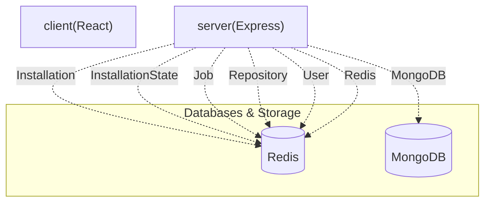

🤖 PushDoc

> PushDoc is a GitHub App that automatically generates, validates, and commits professional `README.md` files to your repositories using AI, complemented by a React frontend for easy management.

     

---

## 📋 Table of Contents
* [✨ Features](#-features)
* [🛠️ Tech Stack](#️-tech-stack)
* [📁 Project Structure](#-project-structure)
* [⚙️ Installation & Setup](#️-installation--setup)
* [🔐 Environment Variables](#-environment-variables)
* [🌐 API Reference](#-api-reference)
* [🗄️ Database Models](#-database-models)
* [📜 Available Scripts](#-available-scripts)

---

## ✨ Features
* **AI-Powered README Generation & Updates**: Automatically generate and update `README.md` files for your repositories using advanced AI models like Google Gemini and Groq.
* **Intelligent README Validation**: Each generated README undergoes a validation process, providing a score and warnings to ensure quality and completeness.
* **Automated GitHub App Workflows**: Leverages GitHub webhooks to listen for repository events, triggering README generation and updates seamlessly.
* **Seamless Repository Integration & Management**: Easily sync your GitHub repositories, activate or deactivate PushDoc for specific projects, and manage installations via a dedicated frontend.
* **Real-time Job Tracking & Logs**: Monitor the status of README generation jobs in real-time, view detailed logs, and track the progress of each operation directly from the dashboard.
* **On-demand README Generation Trigger**: Manually initiate the README generation process for any active repository whenever needed.
* **Secure GitHub OAuth Authentication**: Users authenticate securely through GitHub OAuth, granting PushDoc the necessary permissions to manage their repositories.
* **Scalable Background Processing for AI Tasks**: Asynchronous job queue powered by Redis ensures that AI-intensive operations run efficiently without blocking the main application flow.

---

## 🛠️ Tech Stack
| Category | Technology | Purpose & Role |
| :------------------- | :----------------- | :-------------------------------------------------------- |
| **Frontend/UI** | React | Building dynamic and interactive user interfaces. |
| | Vite | Fast development server and build tool for the frontend. |
| | Tailwind CSS | Utility-first CSS framework for rapid UI styling. |
| | Radix UI | Primitives for building accessible and customizable UI components. |
| | Lucide React | Collection of beautiful and customizable open-source icons. |
| | Sonner | Opinionated toast component for React. |
| **Backend/API** | Node.js | JavaScript runtime for the server-side application. |
| | Express | Web framework for building robust APIs and handling routing. |
| | `clsx` | Utility for constructing `className` strings conditionally. |
| **Database & Cache** | MongoDB | NoSQL database for storing application data (users, repositories, jobs). |
| | Redis | In-memory data store, used for caching and managing job queues. |
| **AI & LLM Services**| Google Gemini | AI model integration for intelligent content generation. |
| | Groq | AI model integration for fast content generation. |
| **Authentication** | JWT | Securely transmits information between parties as a JSON object. |
| | GitHub OAuth | Authentication provider for user login and authorization. |
| **Development Tools**| Autoprefixer | PostCSS plugin to parse CSS and add vendor prefixes. |
| | PostCSS | Tool for transforming CSS with JavaScript plugins. |
| | `tailwind-merge` | Utility to merge Tailwind CSS classes without style conflicts. |

---

## 📁 Project Structure
```
├── client/ # Frontend application (React, Vite)
│ ├── .env.example # Example environment variables for client
│ ├── index.html # Main HTML entry point
│ ├── package-lock.json # Node.js dependency lock file
│ ├── package.json # Frontend project dependencies and scripts
│ ├── src # React source code
│ ├── tailwind.config.js # Tailwind CSS configuration
│ └── vite.config.js # Vite build configuration
├── server/ # Backend API application (Node.js, Express)
│ ├── .env.example # Example environment variables for server
│ ├── nodemon.json # Nodemon configuration for development restarts
│ ├── package-lock.json # Node.js dependency lock file
│ ├── package.json # Backend project dependencies and scripts
│ ├── server.js # Main server entry point
│ └── src # Server source code (controllers, routes, models, services)
├── README.md # This documentation file
├── package-lock.json # Monorepo dependency lock file
├── package.json # Monorepo dependencies and scripts
└── render.yaml # Configuration for Render deployment (if applicable)
```


---

## 🏛️ System Architecture




---

## ⚙️ Installation & Setup

To get PushDoc up and running on your local machine, follow these steps:

### 1. Clone the repository
```bash
git clone https://github.com/your-username/PushDoc.git
cd PushDoc
```

### 2. Configure Environment Variables

Create `.env` files in both the `client/` and `server/` directories based on their respective `.env.example` files.

#### For the server (`server/.env`):
```ini
# Copy contents from server/.env.example and fill in actual values
NODE_ENV=development
PORT=5000
CORS_ORIGIN=http://localhost:3000

MONGODB_URI=your_mongodb_connection_string
REDIS_URL=redis://localhost:6379 # Or separate host/port
REDIS_HOST=localhost
REDIS_PORT=6379

GITHUB_CLIENT_ID=your_github_oauth_app_client_id
GITHUB_CLIENT_SECRET=your_github_oauth_app_client_secret
GITHUB_REDIRECT_URI=http://localhost:5000/auth/github/callback

# GitHub App Configuration
GITHUB_APP_ID=your_github_app_id
GITHUB_APP_NAME=PushDoc
GITHUB_WEBHOOK_SECRET=your_github_app_webhook_secret
GITHUB_PRIVATE_KEY_PATH=./your-private-key.pem # Path to your GitHub App's private key file

JWT_SECRET=your_jwt_secret_key

GEMINI_API_KEY_1=your_gemini_api_key_1
GEMINI_API_KEY_2=your_gemini_api_key_2
GEMINI_API_KEY_3=your_gemini_api_key_3

GROQ_API_KEY_1=your_groq_api_key_1
GROQ_API_KEY_2=your_groq_api_key_2

WORKSPACE_ROOT_PATH=/tmp/pushdoc_workspace # Temporary path for cloning repos
```

#### For the client (`client/.env`):
(Based on standard Vite setup, `VITE_` prefix is assumed if no .env.example for client was explicitly detailed in `CONFIRMED ENV VARS`)
```ini
# No environment variables are explicitly confirmed for the client/.env.example
# in the provided context's CONFIRMED ENV VARS list.
# If required by the client, you would add them here.
```

### 3. Install Dependencies

Install dependencies for both the server and client.

```bash
# Install root dependencies (if any, not explicitly listed in CONFIRMED PACKAGES from root package.json)
# npm install

# Install server dependencies
cd server
npm install
cd ..

# Install client dependencies
cd client
npm install
cd ..
```

### 4. Run the applications

Start both the server and the client in separate terminal windows.

```bash
# Start the server (from the root directory)
cd server
npm start # Or 'npm run dev' if defined in server/package.json (not explicitly listed in CONFIRMED SCRIPTS for server)
cd ..

# Start the client (from the root directory)
cd client
npm run dev
cd ..
```

The client application should now be accessible at `http://localhost:3000` (or as configured by Vite), and the server API at `http://localhost:5000`.

---

## 🔐 Environment Variables

These environment variables are crucial for configuring the PushDoc server and connecting to external services like GitHub, MongoDB, Redis, and AI providers.

| Variable | Required | Description |
| :------------------------ | :------- | :------------------------------------------------------------------ |
| `NODE_ENV` | Yes | Node.js environment (e.g., `development`, `production`). |
| `PORT` | Yes | The port on which the Express server will listen. |
| `CORS_ORIGIN` | Yes | The allowed origin for Cross-Origin Resource Sharing. |
| `MONGODB_URI` | Yes | Connection URI for the MongoDB database. |
| `REDIS_URL` | No | Full connection URL for Redis. |
| `REDIS_HOST` | Yes | Hostname for the Redis server. |
| `REDIS_PORT` | Yes | Port number for the Redis server. |
| `GITHUB_CLIENT_ID` | Yes | Client ID for your GitHub OAuth application. |
| `GITHUB_CLIENT_SECRET` | Yes | Client Secret for your GitHub OAuth application. |
| `GITHUB_REDIRECT_URI` | Yes | Redirect URI registered with your GitHub OAuth application. |
| `GITHUB_APP_ID` | Yes | The ID of your registered GitHub App. |
| `GITHUB_APP_NAME` | Yes | The name of your GitHub App. |
| `GITHUB_WEBHOOK_SECRET` | Yes | Secret token used to verify incoming GitHub webhook payloads. |
| `GITHUB_PRIVATE_KEY_PATH` | Yes | Path to the `.pem` file containing your GitHub App's private key. |
| `JWT_SECRET` | Yes | Secret key used for signing and verifying JSON Web Tokens. |
| `GEMINI_API_KEY_1` | No | API Key for Google Gemini service. |
| `GEMINI_API_KEY_2` | No | Secondary API Key for Google Gemini service. |
| `GEMINI_API_KEY_3` | No | Tertiary API Key for Google Gemini service. |
| `GROQ_API_KEY_1` | No | API Key for Groq service. |
| `GROQ_API_KEY_2` | No | Secondary API Key for Groq service. |
| `WORKSPACE_ROOT_PATH` | No | Base directory for cloning repositories temporarily. |

---

## 🌐 API Reference

The PushDoc API provides endpoints for GitHub integration, repository management, job tracking, and authentication.

| Method | Endpoint | Auth | Description |
| :----- | :----------------------------- | :--- | :----------------------------------------------------------------- |
| `GET` | `/github/login` | No | Initiates the GitHub OAuth login process. |
| `GET` | `/github/callback` | No | Callback endpoint for GitHub OAuth after successful authentication.|
| `GET` | `/app` | Yes | Retrieves details about the installed GitHub App. |
| `GET` | `/install` | Yes | Redirects to GitHub for installing the App on a repository. |
| `GET` | `/install/callback` | Yes | Callback for GitHub App installation. |
| `GET` | `/repositories/sync` | Yes | Synchronizes the user's GitHub repositories with the database. |
| `GET` | `/jobs` | Yes | Fetches a list of all README generation jobs. |
| `GET` | `/jobs/:jobId/logs` | Yes | Retrieves detailed logs for a specific job. |
| `POST` | `/jobs/:jobId/cancel` | Yes | Cancels an ongoing README generation job. |
| `GET` | `/repositories/:repoId/readme` | Yes | Fetches the current or generated README for a specific repository. |
| `POST` | `/repositories/:repoId/trigger`| Yes | Manually triggers README generation for a specified repository. |
| `GET` | `/events/stream` | Yes | Establishes a server-sent events stream for real-time updates. |
| `PATCH`| `/repositories/:repoId/toggle` | Yes | Toggles the active status of PushDoc for a given repository. |
| `GET` | `/` | No | API health check endpoint. |
| `POST` | `/github` | No | Webhook endpoint for receiving events from GitHub. |

---

## 🗄️ Database Models

PushDoc utilizes MongoDB to persist critical application data, including user profiles, GitHub installations, repositories, and job details.

| Model | Key Fields | Description |
| :---------------- | :-------------------------------------------- | :-------------------------------------------------------------------------- |
| `Installation` | `installationId`, `user`, `accountLogin` | Stores information about GitHub App installations. |
| `InstallationState` | `state`, `user`, `expiresAt` | Manages temporary states during the GitHub App installation flow. |
| `Job` | `repository`, `bullJobId`, `status`, `commitSha`| Tracks the lifecycle and details of each README generation task. |
| `Repository` | `githubId`, `installation`, `name`, `owner` | Represents a GitHub repository managed by PushDoc. |
| `User` | `githubId`, `username`, `email` | Stores user profiles authenticated via GitHub. |

---

## 📜 Available Scripts

The client-side application comes with standard development and build scripts powered by Vite.

| Script | Command | Description |
| :------ | :------------- | :---------------------------------------------- |
| `dev` | `vite` | Starts the development server with hot-reloading. |
| `start` | `vite` | Alias for `dev`, starts the development server. |
| `build` | `vite build` | Compiles the client for production deployment. |