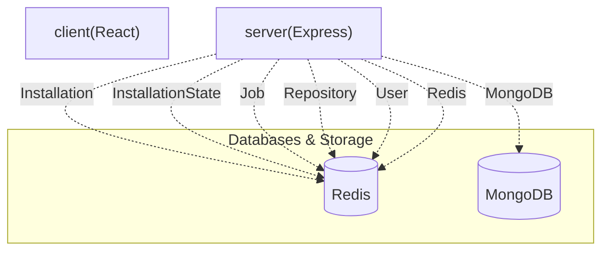

# ⚡ pushdoc-client

[](https://github.com/SudeepKagi/PushDoc)

> **Streamlined GitHub App Management** — A robust client application designed to interface with a backend system, enabling users to manage GitHub App installations, monitor repository activity, and track asynchronous job processing.


---

## 📋 Table of Contents
- [✨ Features](#-features)
- [🛠️ Tech Stack](#️-tech-stack)
- [🏛️ System Architecture](#️-system-architecture)
- [📁 Project Structure](#-project-structure)
- [⚙️ Installation & Setup](#️-installation--setup)
- [🔐 Environment Variables](#-environment-variables)
- [🌐 API Reference](#-api-reference)
- [🗄️ Database Models](#-database-models)
- [📜 Available Scripts](#-available-scripts)

---

## ✨ Features

✨ **Comprehensive User Authentication**
The system supports full user lifecycle management, allowing users to register, login securely, and logout. This is facilitated through robust backend authentication mechanisms.

🔄 **Asynchronous Background Processing**
Manages complex, long-running tasks such as repository synchronization and README generation via BullMQ-powered queues. This ensures that resource-intensive operations do not block the main application thread.

🚀 **GitHub App Installation Management**
Provides robust database storage and operational capabilities for managing GitHub App installations. This includes tracking installation states and associated user accounts.

📦 **Dynamic Repository Management**
Offers comprehensive database storage and operations for monitoring and managing GitHub repositories linked through the app. This enables active control over repository processing and status.

⚙️ **Job Execution Monitoring & Control**
Facilitates database storage and provides operations for tracking the lifecycle of background jobs. Users can view job statuses, access detailed logs, and cancel ongoing jobs through dedicated API endpoints.

📡 **Real-time Event Streaming**
Enables clients to receive real-time updates and events via a dedicated streaming endpoint. This ensures users are immediately informed of changes in job status or repository activity.

---

## 🛠️ Tech Stack

| Category | Technology | Purpose & Role in Codebase |
| :------------------------- | :------------- | :---------------------------------------------------------------------------------------------------------------------------------------- |
| Frontend/UI | React | Core library for building the user interface of the client application. |
| | Vite | Fast development build tool and bundler for the client-side application. |
| | Tailwind CSS | Utility-first CSS framework for rapidly styling the client interface. |
| | Radix UI | Provides unstyled, accessible UI components for building the client interface. |
| Backend/API | Node.js | JavaScript runtime environment for the server-side application. |
| | Express | Web framework for building the server-side API, handling routing, and middleware. |
| Persistence & Caching | MongoDB | NoSQL database used for storing persistent application data, including users, installations, repositories, and jobs. |
| | Redis | In-memory data store used for caching and as a message broker for BullMQ. |
| Task Queue & Background Jobs | BullMQ | Distributed job queue library for managing and processing asynchronous tasks, leveraging Redis. |
| AI & Inference | Google Gemini | Implied integration for AI inference tasks, configured via API keys. |
| | Groq | Implied integration for AI inference tasks, configured via API keys. |
| Authentication & Security | GitHub OAuth | Handles user authentication and authorization by integrating with GitHub's OAuth flow. |
| | JWT | JSON Web Tokens for securing API endpoints and managing user sessions. |

---

## 🏛️ System Architecture

The system operates as a client-server architecture. The `pushdoc-client` (React application) communicates with an Express-based Node.js backend API. The backend orchestrates interactions with GitHub, manages persistent data in MongoDB, and utilizes Redis for caching and asynchronous job processing via BullMQ.





---

## 📁 Project Structure

```
.
├── .github/ # GitHub-specific configurations, including workflow definitions
│ └── workflows # Contains GitHub Actions workflow files
├── client/ # Frontend client application (React, Vite, Tailwind CSS)
│ ├── .env.example # Example environment variables for the client
│ ├── index.html # Main HTML file for the client application
│ ├── package-lock.json # Records the exact dependency tree for client
│ ├── package.json # Client application dependencies and scripts
│ ├── src # Client source code (React components, utilities, etc.)
│ ├── tailwind.config.js # Tailwind CSS configuration for the client
│ └── vite.config.js # Vite build configuration for the client
├── server/ # Backend server application (Node.js, Express)
│ ├── .env.example # Example environment variables for the server
│ ├── nodemon.json # Configuration for Nodemon, used for server development
│ ├── package-lock.json # Records the exact dependency tree for server
│ ├── package.json # Server application dependencies and scripts
│ ├── server.js # Main entry point for the server application
│ └── src # Server source code (controllers, models, routes, services)
├── README.md # This README file
├── package-lock.json # Root-level lockfile (potentially for monorepo tooling)
├── package.json # Root-level metadata for the monorepo
└── render.yaml # Configuration file for deployment on Render.com
```

---

## ⚙️ Installation & Setup

To get the `pushdoc-client` up and running, follow these steps:

1. **Prerequisites**
 * Node.js (LTS recommended) and npm installed.
 * A running MongoDB instance reachable via a connection URI.
 * A running Redis instance reachable via a connection URL.

2. **Clone & Install Dependencies**

 ```bash
 git clone https://github.com/your-org/pushdoc-client.git
 cd pushdoc-client

 # Install client dependencies
 cd client
 npm install
 cd ..

 # Install server dependencies (assuming it's part of the monorepo)
 cd server
 npm install
 cd ..
 ```

3. **Environment Setup**
 Copy the example environment files for both the client and server services:

 ```bash
 cp client/.env.example client/.env
 cp server/.env.example server/.env
 ```

 Edit the `.env` files in `client/` and `server/` with your specific configuration details, including database connection strings, Redis URLs, and GitHub App credentials.

4. **Running Locally**
 To start the `pushdoc-client` frontend application in development mode:

 ```bash
 cd client
 npm run dev
 ```

 The client application will typically be available at `http://localhost:5173`. You will need to start the backend server separately, using its own `npm` scripts not detailed in this `package.json`.

5. **Production Build**
 To create a production-ready build of the `pushdoc-client` frontend:

 ```bash
 cd client
 npm run build
 ```

 The compiled assets will be placed in the `dist` directory within the `client/` folder.

---

## 🔐 Environment Variables

The server component of the system relies on the following environment variables for configuration. These are defined in `server/.env.example`:

| Variable | Description | Example / Default | Required |
| :----------------------- | :-------------------------------------------------------------------------- | :------------------------------------------ | :------- |
| `NODE_ENV` | Node.js environment mode. | `development` / `production` | Yes |
| `PORT` | Port on which the server will listen. | `8000` | Yes |
| `CORS_ORIGIN` | Allowed origin for Cross-Origin Resource Sharing (CORS). | `http://localhost:5173` | Yes |
| `MONGODB_URI` | Connection URI for the MongoDB database. | `mongodb://127.0.0.1:27017/pushdoc` | Yes |
| `REDIS_URL` | Connection URL for the Redis server (if applicable, overrides host/port). | `redis://localhost:6379` | No |
| `REDIS_HOST` | Hostname for the Redis server. | `localhost` | No |
| `REDIS_PORT` | Port for the Redis server. | `6379` | No |
| `GITHUB_CLIENT_ID` | Client ID for your GitHub OAuth App. | `your_github_client_id` | Yes |
| `GITHUB_CLIENT_SECRET` | Client Secret for your GitHub OAuth App. | `your_github_client_secret` | Yes |
| `GITHUB_REDIRECT_URI` | Redirect URI after GitHub OAuth authentication. | `http://localhost:8000/github/callback` | Yes |
| `GITHUB_APP_ID` | ID of your GitHub App. | `your_github_app_id` | Yes |
| `GITHUB_APP_NAME` | Name of your GitHub App. | `pushdoc-app` | Yes |
| `GITHUB_WEBHOOK_SECRET` | Secret for verifying GitHub webhook payloads. | `your_webhook_secret` | Yes |
| `GITHUB_PRIVATE_KEY_PATH`| Path to the GitHub App's private key file. | `./github-app-private-key.pem` | Yes |
| `JWT_SECRET` | Secret key for signing JSON Web Tokens. | `your_jwt_secret` | Yes |
| `GEMINI_API_KEY_1` | API Key for Google Gemini service (instance 1). | `your_gemini_api_key_1` | No |
| `GEMINI_API_KEY_2` | API Key for Google Gemini service (instance 2). | `your_gemini_api_key_2` | No |
| `GEMINI_API_KEY_3` | API Key for Google Gemini service (instance 3). | `your_gemini_api_key_3` | No |
| `GROQ_API_KEY_1` | API Key for Groq service (instance 1). | `your_groq_api_key_1` | No |
| `GROQ_API_KEY_2` | API Key for Groq service (instance 2). | `your_groq_api_key_2` | No |
| `WORKSPACE_ROOT_PATH` | Root path for temporary workspace files/directories. | `./workspace` | No |

---

## 🌐 API Reference

The backend API provides the following endpoints for interaction:

| Method | Endpoint | Description | Auth Required |
| :----- | :----------------------------- | :-------------------------------------------------------------- | :------------ |
| `GET` | `/github/login` | Initiates GitHub OAuth login flow. | No |
| `GET` | `/github/callback` | Callback endpoint for GitHub OAuth. | No |
| `GET` | `/me` | Retrieves the authenticated user's profile information. | Yes |
| `POST` | `/logout` | Logs out the current user. | Yes |
| `GET` | `/app` | Retrieves GitHub App details. | Yes |
| `GET` | `/install` | Initiates GitHub App installation flow. | No |
| `GET` | `/install/callback` | Callback endpoint after GitHub App installation. | No |
| `GET` | `/repositories/sync` | Triggers synchronization of user repositories. | Yes |
| `GET` | `/jobs` | Retrieves a list of all jobs. | Yes |
| `GET` | `/jobs/:jobId/logs` | Retrieves logs for a specific job. | Yes |
| `POST` | `/jobs/:jobId/cancel` | Cancels an ongoing job. | Yes |
| `GET` | `/repositories/:repoId/readme` | Retrieves the README content for a specified repository. | Yes |
| `POST` | `/repositories/:repoId/trigger`| Triggers a manual processing job for a repository. | Yes |
| `GET` | `/events/stream` | Establishes a server-sent events (SSE) stream for real-time updates. | Yes |
| `PATCH`| `/repositories/:repoId/toggle` | Toggles the active status of a repository. | Yes |
| `GET` | `/health` | Checks the health status of the API service. | No |
| `GET` | `/ready` | Checks if the API service is ready to accept requests. | No |
| `GET` | `/` | Root endpoint providing basic API status and readiness. | No |
| `POST` | `/github` | Receives and processes GitHub webhook payloads. | No (Webhook secret) |

---

## 🗄️ Database Models

The backend utilizes the following MongoDB models:

| Model | Key Fields | Purpose & System Relationships |
| :-------------- | :---------------------------------------- | :---------------------------------------------------------------------------------------------------------------------------------- |
| `Installation` | `installationId`, `user`, `accountLogin`, `accountType` | Stores details of GitHub App installations, linking to a `User` and GitHub account information. |
| `InstallationState` | `state`, `user`, `expiresAt` | Manages temporary states during the GitHub App installation process, typically with an expiry to prevent stale entries. |
| `Job` | `repository`, `bullJobId`, `commitSha`, `branch`, `status`, `startedAt`, `completedAt`, `duration` | Records details of asynchronous background tasks, including status, associated repository, and timestamps. Links to `Repository`. |
| `Repository` | `githubId`, `installation`, `name`, `fullName`, `owner`, `private`, `cloneUrl`, `isActive` | Stores information about GitHub repositories integrated with the app, linking to an `Installation`. |
| `User` | `githubId`, `username`, `displayName`, `email`, `avatarUrl`, `githubAccessToken`, `provider` | Manages user profiles, primarily authenticated via GitHub, storing access tokens and profile details. |

---

## 📜 Available Scripts

The `pushdoc-client` frontend provides the following npm scripts:

* `dev`: Starts the client development server using Vite, enabling hot-module replacement and other development features.
* `start`: Serves the client application (typically used after a build, but here points to Vite's dev server).
* `build`: Compiles the client React application for production, generating optimized static assets.