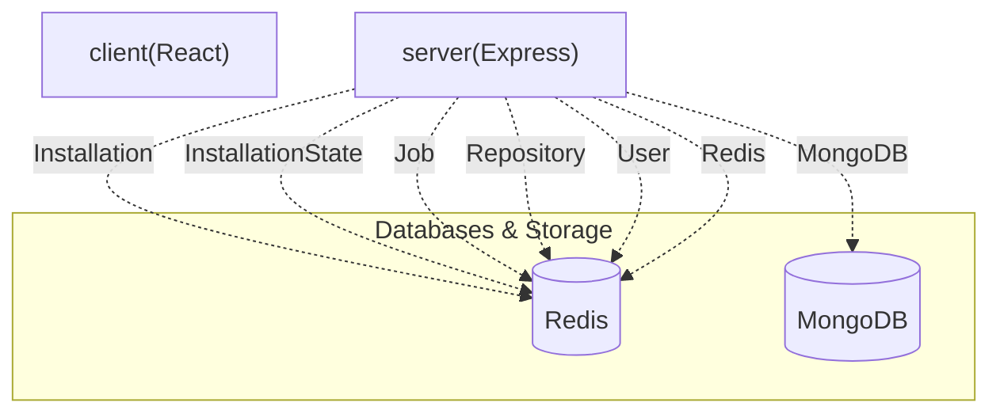

# 📝 PushDoc: AI-Powered GitHub README Generator

> PushDoc is a fullstack GitHub App that automatically generates and commits professional README.md files to your repositories using advanced AI models like Gemini and Groq, all managed through an intuitive web interface.

   

---

## 📋 Table of Contents
* [✨ Features](#-features)
* [🛠️ Tech Stack](#️-tech-stack)
* [📁 Project Structure](#-project-structure)
* [⚙️ Installation & Setup](#️-installation--setup)
* [🔐 Environment Variables](#-environment-variables)
* [🌐 API Reference](#-api-reference)
* [🗄️ Database Models](#️-database-models)
* [📜 Available Scripts](#-available-scripts)

---

## ✨ Features
* **AI-Powered README Generation**: Leverages advanced AI models (Gemini, Groq) to intelligently generate comprehensive and professional README.md files.
* **GitHub App Integration**: Seamlessly integrates with GitHub, allowing users to install the app on their repositories and manage settings directly.
* **Automated Workflow**: Triggers README generation based on repository events (via webhooks) or manual commands through the PushDoc interface.
* **Real-time Job Monitoring**: Provides a dashboard to monitor the status, logs, and progress of all README generation jobs in real-time.
* **Repository Management**: Easily sync, activate, and deactivate repositories for README generation within the application.
* **Secure GitHub OAuth**: Authenticate and manage access securely through GitHub's OAuth flow.
* **Robust Background Processing**: Utilizes a powerful job queueing system (backed by Redis) to handle intensive README generation tasks efficiently.
* **API Key Flexibility**: Supports multiple API keys for AI models, enhancing reliability and scalability.

---

## 🛠️ Tech Stack
| Category | Technology | Purpose |
| :------------------- | :------------------------------ | :-------------------------------------------- |
| **Client Framework** | React (with Vite) | Building the interactive user interface |
| **Styling & UI** | Tailwind CSS, Radix UI | Responsive design and accessible UI components |
| **Backend Runtime** | Node.js | Server-side logic and API |
| **Web Framework** | Express.js | Handling API routes and middleware |
| **Database** | MongoDB | Persistent storage for user, repo, job data |
| **Caching/Queuing** | Redis | Job queuing, caching, and real-time events |
| **Authentication** | GitHub OAuth, JSON Web Tokens (JWT) | Secure user authentication and authorization |
| **AI Integration** | Gemini API, Groq API | Powering intelligent README content generation |

---

## 📁 Project Structure
```
.
├── client/ # Frontend application powered by React and Vite
│ ├── .env.example # Example environment variables for the client
│ ├── index.html # Main HTML entry point
│ ├── package-lock.json # Frontend dependency lock file
│ ├── package.json # Frontend dependencies and scripts
│ ├── src # Client-side source code (React components, logic)
│ ├── tailwind.config.js # Tailwind CSS configuration
│ └── vite.config.js # Vite build tool configuration
├── server/ # Backend application powered by Node.js and Express
│ ├── .env.example # Example environment variables for the server
│ ├── nodemon.json # Nodemon configuration for development auto-restarts
│ ├── package-lock.json # Backend dependency lock file
│ ├── package.json # Backend dependencies and scripts
│ ├── server.js # Main server entry point
│ └── src # Server-side source code (controllers, models, routes)
├── README.md # Project README file
├── package-lock.json # Root dependency lock file (if monorepo root)
├── package.json # Root dependencies and scripts (if monorepo root)
└── render.yaml # Deployment configuration for Render.com (inferred)
```


---

## 🏛️ System Architecture




---

## ⚙️ Installation & Setup

To get PushDoc up and running on your local machine, follow these steps:

1. **Clone the Repository**
 ```bash
 git clone https://github.com/your-username/pushdoc.git
 cd pushdoc
 ```

2. **Install Dependencies**
 Install dependencies for both the `client` and `server` services:
 ```bash
 cd client
 npm install
 cd ../server
 npm install
 cd ..
 # Or, if you prefer to install all at once from the root:
 npm install
 ```

3. **Configure Environment Variables**
 Create `.env` files in both `client/` and `server/` directories by copying their respective `.env.example` files:
 ```bash
 cp client/.env.example client/.env
 cp server/.env.example server/.env
 ```
 Edit the `.env` files with your specific configurations. Refer to the [Environment Variables](#-environment-variables) section for details.

4. **Run the Applications**
 Start the frontend and backend services.
 *To start the client (development server):*
 ```bash
 cd client
 npm run dev
 # or
 npm start
 ```
 *To start the server:* (No confirmed scripts for server directly, so typical `node` command or `nodemon` if configured locally.)
 ```bash
 # Assuming 'server.js' is the entry point
 cd server
 node server.js
 ```
 Your PushDoc application should now be running!

---

## 🔐 Environment Variables
Configure these environment variables in `server/.env` and `client/.env` (where applicable) for the application to function correctly.

| Variable | Required | Description |
| :------------------------ | :------- | :------------------------------------------------------------------ |
| `NODE_ENV` | Yes | Application environment (e.g., `development`, `production`). |
| `PORT` | Yes | The port the server will listen on. |
| `CORS_ORIGIN` | Yes | The origin allowed for CORS requests (e.g., `http://localhost:3000`). |
| `MONGODB_URI` | Yes | Connection string for your MongoDB database. |
| `REDIS_URL` | Yes | Connection URL for your Redis instance. |
| `REDIS_HOST` | Yes | Host for Redis. |
| `REDIS_PORT` | Yes | Port for Redis. |
| `GITHUB_CLIENT_ID` | Yes | Your GitHub OAuth App Client ID. |
| `GITHUB_CLIENT_SECRET` | Yes | Your GitHub OAuth App Client Secret. |
| `GITHUB_REDIRECT_URI` | Yes | The callback URI for GitHub OAuth. |
| `GITHUB_APP_ID` | Yes | Your GitHub App ID. |
| `GITHUB_APP_NAME` | Yes | The name of your GitHub App. |
| `GITHUB_WEBHOOK_SECRET` | Yes | Secret for verifying GitHub webhook payloads. |
| `GITHUB_PRIVATE_KEY_PATH` | Yes | Path to your GitHub App's private key file. |
| `JWT_SECRET` | Yes | Secret key for signing and verifying JSON Web Tokens. |
| `GEMINI_API_KEY_1` | Yes | API key for Google Gemini model (primary). |
| `GEMINI_API_KEY_2` | No | Additional API key for Google Gemini model (fallback/load balancing). |
| `GEMINI_API_KEY_3` | No | Additional API key for Google Gemini model. |
| `GROQ_API_KEY_1` | Yes | API key for Groq API (primary). |
| `GROQ_API_KEY_2` | No | Additional API key for Groq API. |
| `WORKSPACE_ROOT_PATH` | Yes | Root path for temporary workspace directories. |

---

## 🌐 API Reference
The PushDoc backend provides a comprehensive set of API endpoints to manage GitHub integrations, repositories, and README generation jobs.

| Method | Endpoint | Auth | Description |
| :----- | :---------------------------- | :-------------------- | :----------------------------------------------------- |
| `GET` | `/github/login` | No | Initiates GitHub OAuth login flow. |
| `GET` | `/github/callback` | No | Callback endpoint for GitHub OAuth authentication. |
| `GET` | `/app` | Authenticated | Retrieves GitHub App configuration details. |
| `GET` | `/install` | Authenticated | Initiates GitHub App installation flow. |
| `GET` | `/install/callback` | Authenticated | Callback endpoint for GitHub App installation. |
| `GET` | `/repositories/sync` | Authenticated | Synchronizes user's GitHub repositories. |
| `GET` | `/jobs` | Authenticated | Retrieves a list of all README generation jobs. |
| `GET` | `/jobs/:jobId/logs` | Authenticated | Fetches logs for a specific README generation job. |
| `POST` | `/jobs/:jobId/cancel` | Authenticated | Cancels a running or queued README generation job. |
| `GET` | `/repositories/:repoId/readme`| Authenticated | Retrieves the README content for a specific repository.|
| `POST` | `/repositories/:repoId/trigger`| Authenticated | Manually triggers README generation for a repository. |
| `GET` | `/events/stream` | Authenticated | Establishes a server-sent events stream for real-time updates. |
| `PATCH`| `/repositories/:repoId/toggle`| Authenticated | Toggles activation status for a repository. |
| `GET` | `/` | No | Health check endpoint for the PushDoc API. |
| `POST` | `/github` | Webhook Secret Header | Receives and processes GitHub webhook events. |

---

## 🗄️ Database Models
PushDoc uses MongoDB to store essential data related to users, installations, repositories, and job execution.

| Model | Key Fields | Description |
| :---------------- | :-------------------------------------------- | :------------------------------------------------------------------- |
| `Installation` | `installationId`, `user` | Stores details about each GitHub App installation. |
| `InstallationState` | `state`, `user`, `expiresAt` | Manages temporary state during GitHub App installation flows. |
| `Job` | `repository`, `bullJobId`, `commitSha`, `branch` | Tracks the lifecycle and results of each README generation task. |
| `Repository` | `githubId`, `installation`, `name`, `owner` | Stores information about GitHub repositories managed by the app. |
| `User` | `githubId`, `username` | Stores user profiles linked via GitHub authentication. |

---

## 📜 Available Scripts
These scripts are available in the `client/package.json` for frontend development:

* `npm run dev`: Starts the Vite development server, providing hot-reloading and a local environment for the client.
* `npm start`: An alias for `npm run dev`, also starts the development server.
* `npm run build`: Compiles the React application for production deployment, optimizing assets and code.