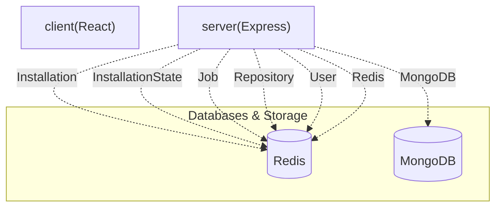

# ✨ PushDoc: AI-Powered README Generation for GitHub Repositories

> PushDoc is a GitHub App that automates the creation and maintenance of professional README.md files for your repositories using advanced AI models, all managed through an intuitive web dashboard.

  

---

## 📋 Table of Contents
* [✨ Features](#-features)
* [🛠️ Tech Stack](#️-tech-stack)
* [📁 Project Structure](#-project-structure)
* [⚙️ Installation & Setup](#️-installation--setup)
* [🔐 Environment Variables](#-environment-variables)
* [🌐 API Reference](#-api-reference)
* [🗄️ Database Models](#️-database-models)
* [📜 Available Scripts](#-available-scripts)

---

## ✨ Features

* **AI-Powered README Generation**: Automatically crafts comprehensive and professional README.md files for your GitHub repositories using advanced AI models (Gemini, Groq).
* **Automated Updates**: Leverages GitHub webhooks to detect repository changes and automatically trigger README regeneration, ensuring your documentation stays current.
* **Manual Triggering**: Provides the flexibility to manually initiate README generation for any selected repository directly from the dashboard.
* **GitHub App Integration**: Seamlessly integrates with your GitHub account, allowing for easy installation and management of repositories.
* **Real-time Job Monitoring**: Monitor the status and progress of all README generation jobs in real-time, including detailed logs for each step (cloning, reading, generating, committing, pushing).
* **Repository Management Dashboard**: A user-friendly interface to manage installed repositories, activate/deactivate PushDoc for specific repos, and view generated READMEs.
* **Robust Background Processing**: Utilizes a powerful job queue system to handle asynchronous tasks, ensuring scalability and reliability for README generation workflows.
* **User Authentication**: Secure authentication via GitHub OAuth, allowing users to manage their installations and repositories.

---

## 🛠️ Tech Stack

| Category | Technology | Purpose |
| :--------------- | :------------ | :---------------------------------------------------- |
| **Backend** | Node.js | JavaScript runtime environment |
| | Express | Web application framework for the API server |
| **Frontend** | React | UI library for building interactive user interfaces |
| | Vite | Fast build tool and development server |
| **Database** | MongoDB | NoSQL database for persistent data storage |
| **Caching/Queue**| Redis | In-memory data store for caching and job queuing |
| **AI Models** | Gemini, Groq | AI services for generating README content |
| **Authentication** | JWT | JSON Web Tokens for secure API authentication |
| **UI Components**| Radix UI | Primitives for building accessible UI components |
| **Styling** | Tailwind CSS | Utility-first CSS framework for rapid styling |
| **Icons** | Lucide React | Collection of beautiful and customizable open-source icons |
| **Notifications**| Sonner | Accessible and beautiful toast notifications |

---

## 📁 Project Structure

```
.
├── client/ # Frontend application (React, Vite)
│ ├── .env.example # Example environment variables for the client
│ ├── index.html # Main HTML entry point
│ ├── package-lock.json # Frontend dependency lock file
│ ├── package.json # Frontend dependencies and scripts
│ ├── src # Frontend source code (components, pages, logic)
│ ├── tailwind.config.js # Tailwind CSS configuration
│ └── vite.config.js # Vite build configuration
├── server/ # Backend application (Node.js, Express)
│ ├── .env.example # Example environment variables for the server
│ ├── nodemon.json # Nodemon configuration for development
│ ├── package-lock.json # Backend dependency lock file
│ ├── package.json # Backend dependencies and scripts
│ ├── server.js # Main server entry file
│ └── src # Backend source code (controllers, models, routes, services, workers)
├── README.md # Project README file
├── package-lock.json # Root dependency lock file (likely for monorepo)
├── package.json # Root dependencies and scripts
└── render.yaml # Configuration for deployment (e.g., Render.com)
```


---

## 🏛️ System Architecture




---

## ⚙️ Installation & Setup

Follow these steps to get PushDoc up and running on your local machine.

### 1. Clone the repository

```bash
git clone https://github.com/your-username/pushdoc.git
cd pushdoc
```

### 2. Install Dependencies

Install dependencies for both the server and client applications:

```bash
cd server
npm install
cd ../client
npm install
cd ..
```

### 3. Configure Environment Variables

Create `.env` files in both the `server/` and `client/` directories based on their respective `.env.example` files.

* `server/.env`:
 ```ini
 NODE_ENV=development
 PORT=5000
 CORS_ORIGIN=http://localhost:3000
 MONGODB_URI=<Your_MongoDB_Connection_String>
 REDIS_URL=<Your_Redis_Connection_String>
 REDIS_HOST=<Your_Redis_Host>
 REDIS_PORT=<Your_Redis_Port>
 GITHUB_CLIENT_ID=<Your_GitHub_OAuth_Client_ID>
 GITHUB_CLIENT_SECRET=<Your_GitHub_OAuth_Client_Secret>
 GITHUB_REDIRECT_URI=http://localhost:5000/auth/github/callback
 GITHUB_APP_ID=<Your_GitHub_App_ID>
 GITHUB_APP_NAME=<Your_GitHub_App_Name>
 GITHUB_WEBHOOK_SECRET=<Your_GitHub_App_Webhook_Secret>
 GITHUB_PRIVATE_KEY_PATH=<Path_To_Your_GitHub_App_Private_Key_File>
 JWT_SECRET=<Your_JWT_Secret_Key>
 GEMINI_API_KEY_1=<Your_Gemini_API_Key_1>
 GEMINI_API_KEY_2=<Your_Gemini_API_Key_2>
 GEMINI_API_KEY_3=<Your_Gemini_API_Key_3>
 GROQ_API_KEY_1=<Your_Groq_API_Key_1>
 GROQ_API_KEY_2=<Your_Groq_API_Key_2>
 WORKSPACE_ROOT_PATH=<Path_To_Your_Workspace_Root>
 ```
* `client/.env`: You may need to add `VITE_API_BASE_URL=http://localhost:5000` or similar depending on the client's configuration to point to the backend. Refer to client's `.env.example` for specific variables.

**Note**: For `GITHUB_PRIVATE_KEY_PATH`, this should be a path to a `.pem` file containing your GitHub App's private key.

### 4. Run the applications

#### Start the Server

From the `server/` directory:

```bash
npm start # Or node server.js if no start script
```

#### Start the Client (Frontend)

From the `client/` directory:

```bash
npm run dev
```

The frontend application will typically be available at `http://localhost:3000` (or similar, as configured by Vite), and the backend API at `http://localhost:5000`.

---

## 🔐 Environment Variables

These environment variables are required to run the PushDoc backend server.

| Variable | Required | Description |
| :-------------------- | :------- | :------------------------------------------------------------------ |
| `NODE_ENV` | Yes | Node.js environment (`development`, `production`, `test`) |
| `PORT` | Yes | Port on which the server will listen |
| `CORS_ORIGIN` | Yes | Origin allowed for Cross-Origin Resource Sharing (CORS) |
| `MONGODB_URI` | Yes | Connection string for MongoDB database |
| `REDIS_URL` | No | Full Redis connection URL (overrides host/port if provided) |
| `REDIS_HOST` | Yes | Host for Redis server (if `REDIS_URL` is not used) |
| `REDIS_PORT` | Yes | Port for Redis server (if `REDIS_URL` is not used) |
| `GITHUB_CLIENT_ID` | Yes | GitHub OAuth App Client ID for user authentication |
| `GITHUB_CLIENT_SECRET`| Yes | GitHub OAuth App Client Secret for user authentication |
| `GITHUB_REDIRECT_URI` | Yes | Redirect URI for GitHub OAuth callback |
| `GITHUB_APP_ID` | Yes | Your GitHub App's unique ID |
| `GITHUB_APP_NAME` | Yes | Name of your GitHub App |
| `GITHUB_WEBHOOK_SECRET`| Yes | Secret for verifying GitHub webhook payloads |
| `GITHUB_PRIVATE_KEY_PATH`| Yes | Path to the `.pem` file containing your GitHub App's private key |
| `JWT_SECRET` | Yes | Secret key for signing JSON Web Tokens |
| `GEMINI_API_KEY_1` | Yes | API key for Google Gemini AI service (1 of 3) |
| `GEMINI_API_KEY_2` | No | API key for Google Gemini AI service (2 of 3, for redundancy/load) |
| `GEMINI_API_KEY_3` | No | API key for Google Gemini AI service (3 of 3, for redundancy/load) |
| `GROQ_API_KEY_1` | Yes | API key for Groq AI service (1 of 2) |
| `GROQ_API_KEY_2` | No | API key for Groq AI service (2 of 2, for redundancy/load) |
| `WORKSPACE_ROOT_PATH` | No | Root path for cloning repositories and temporary files |

---

## 🌐 API Reference

The PushDoc server exposes the following REST API endpoints:

| Method | Endpoint | Auth | Description |
| :----- | :-------------------------- | :--- | :---------------------------------------------------------------- |
| `GET` | `/github/login` | No | Initiates GitHub OAuth login flow. |
| `GET` | `/github/callback` | No | Callback endpoint for GitHub OAuth after user authorization. |
| `GET` | `/app` | Yes | Retrieves information about the GitHub App. |
| `GET` | `/install` | No | Redirects to GitHub for installing the App on repositories. |
| `GET` | `/install/callback` | No | Callback endpoint after GitHub App installation. |
| `GET` | `/repositories/sync` | Yes | Syncs the user's GitHub repositories with the PushDoc database. |
| `GET` | `/jobs` | Yes | Retrieves a list of all README generation jobs. |
| `GET` | `/jobs/:jobId/logs` | Yes | Fetches detailed logs for a specific README generation job. |
| `POST` | `/jobs/:jobId/cancel` | Yes | Cancels an ongoing or queued README generation job. |
| `GET` | `/repositories/:repoId/readme`| Yes | Retrieves the latest generated README for a specific repository. |
| `POST` | `/repositories/:repoId/trigger`| Yes | Triggers a manual README generation for a specific repository. |
| `GET` | `/events/stream` | Yes | Establishes a server-sent event (SSE) stream for real-time updates.|
| `PATCH`| `/repositories/:repoId/toggle`| Yes | Toggles PushDoc's active status for a specific repository. |
| `GET` | `/` | No | Health check endpoint for API status and Redis connection. |
| `POST` | `/github` | No | GitHub webhook endpoint for processing repository events. |

---

## 🗄️ Database Models

PushDoc uses MongoDB to store various application data, managed by the following Mongoose models:

| Model | Key Fields | Description |
| :-------------- | :--------------------- | :------------------------------------------------------------ |
| `Installation` | `installationId`, `user` | Stores GitHub App installation details and associated user. |
| `InstallationState` | `state`, `user`, `expiresAt` | Manages temporary state during GitHub App installation flow. |
| `Job` | `repository`, `bullJobId`, `commitSha`, `branch`, `status` | Tracks the lifecycle and details of each README generation job.|
| `Repository` | `githubId`, `installation`, `name`, `fullName`, `owner` | Stores information about GitHub repositories managed by PushDoc.|
| `User` | `githubId`, `username`, `githubAccessToken` | Stores user profiles and their GitHub authentication tokens. |

---

## 📜 Available Scripts

The client application's `package.json` includes these convenient scripts for development and building:

* `dev`: Starts the development server using Vite.
 ```bash
 npm run dev
 ```
* `start`: Alias for `npm run dev`, starts the development server.
 ```bash
 npm start
 ```
* `build`: Compiles the client application for production using Vite.
 ```bash
 npm run build
 ```