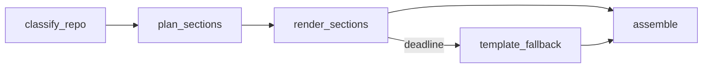

# PushDoc AI graph

```mermaid
flowchart LR
  classify_repo --> plan_sections --> render_sections --> assemble
  render_sections -->|deadline| template_fallback
  template_fallback --> assemble
```

Each job uses its `job_id` as the LangGraph `thread_id` once the Phase 6 job API supplies durable checkpoints.
